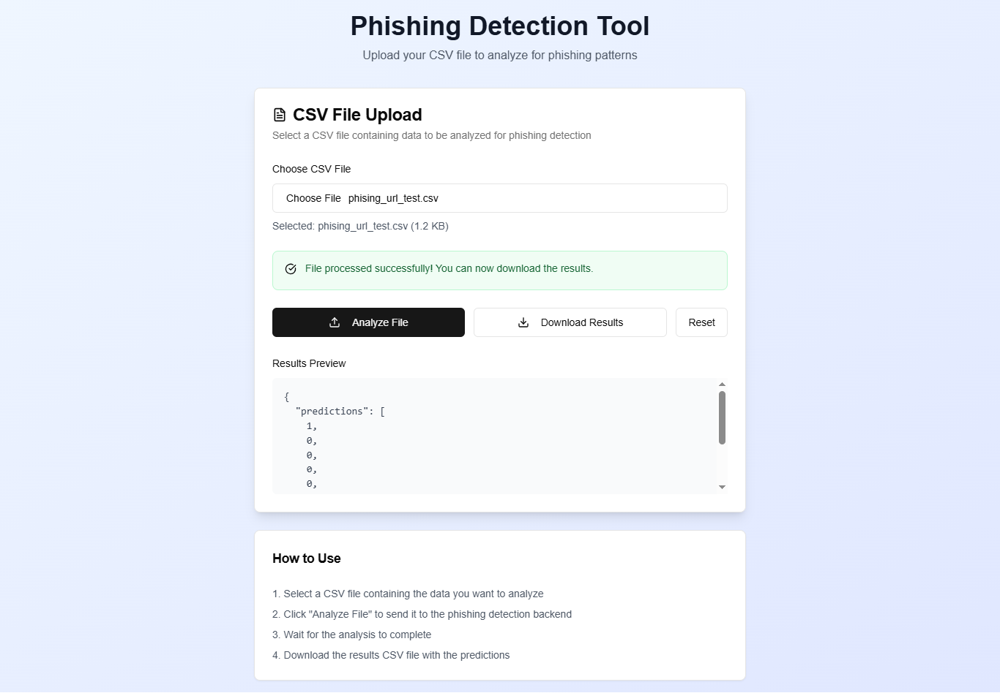

# Phishing URL Detection with BERT and CNN

This repository contains two Jupyter notebooks for phishing URL detection using deep learning:
- **bert-classification (1).ipynb**: Combines BERT-based feature extraction with a CNN classifier.
- **phishingurlclassification.ipynb**: Fine-tunes DistilBERT for phishing URL classification.

A sample video demonstration is also included.

## Notebooks Overview

### 1. bert-classification (1).ipynb
- **Data Loading & Preprocessing**: Loads a phishing URL dataset, selects relevant features, and splits the data.
- **Feature Engineering**: Combines text features (URL, Domain, TLD, Title) and uses a pre-trained BERT model to extract embeddings. Numerical features are concatenated.
- **Dimensionality Reduction**: Applies PCA to reduce feature dimensionality.
- **Classification**: Trains a 1D CNN on the combined features for binary classification.
- **Evaluation**: Reports accuracy, loss curves, and confusion matrix.

### 2. phishingurlclassification.ipynb
- **Data Loading & EDA**: Loads the dataset, performs exploratory data analysis, and visualizes feature correlations.
- **Text Preparation**: Combines text fields and splits data into train/validation/test sets.
- **Tokenization**: Uses DistilBERT tokenizer for input preparation.
- **Model Training**: Fine-tunes DistilBERT for sequence classification using HuggingFace Trainer.
- **Evaluation**: Plots loss curves and computes test accuracy.
- **Model Saving**: Saves the fine-tuned model and tokenizer.

## Requirements
- Python 3.x
- PyTorch
- Transformers (HuggingFace)
- scikit-learn
- pandas, numpy, matplotlib, seaborn

Install requirements with:
```bash
pip install torch transformers scikit-learn pandas numpy matplotlib seaborn
```

## Usage
Open either notebook in Jupyter and run all cells. Make sure the dataset is available at the expected path or update the path in the code.

## Project Visuals

### Video Demonstration
You can watch a demonstration of the project below:

[](phishing-mp4.mp4)

Or download/view the video directly: [phishing-mp4.mp4](phishing-mp4.mp4)

### Project Image
Below is a sample image from the project:



---

**Note:**
- The notebooks expect the dataset in a specific format. Adjust paths as needed.
- GPU is recommended for faster training.


